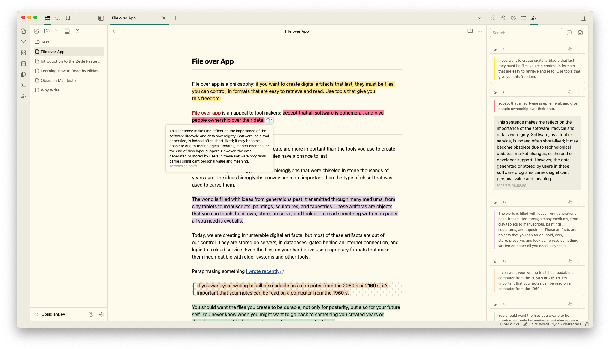
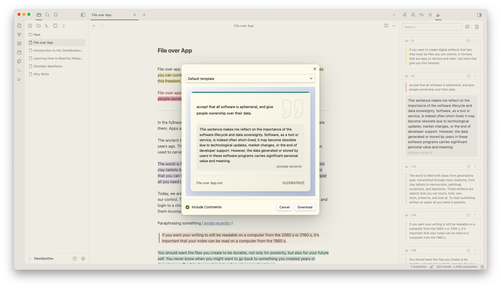
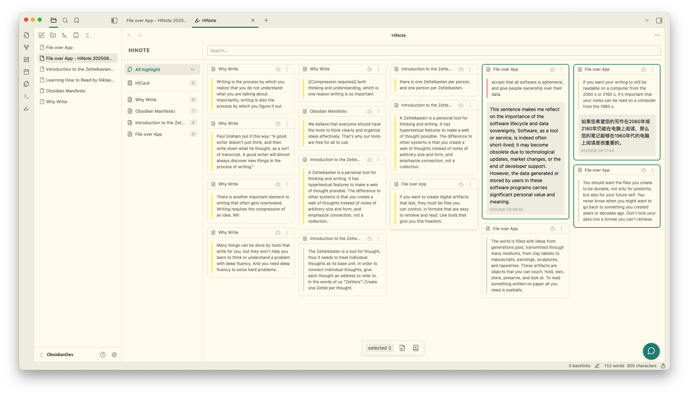

	<h1>HiNote - Highlight Text with Comments</h1>
	
	
	
	
	

---

[简体中文](./README-ZH.md) | English

This custom build of HiNote automatically extracts highlighted text from notes, lets users add comments, and copies highlights to the clipboard as knowledge-card images.

> This fork is based on HiNote 0.5.5 and deliberately removes all AI, chat, HiCard, FSRS, licensing, activation, and note-export code. Highlight, comment, and image-copy behavior is retained.

👇🏻 Click the image to view the video tutorial

---

## ✨ Key Features

🎯 Auto-extract highlights in multiple formats | 📝 Add comments and notes to highlights | 📸 Copy beautiful knowledge cards to the clipboard

---

## Highlighted text retrieval

When you open a note with highlighted text, the sidebar automatically displays the highlighted text in card format. The following three formats of highlight tags are supported: `==`, `<mark>`, and ``. Custom formats can also be defined using regular expressions.

---

## Highlighted comments

The highlight comment feature allows you to quickly engage with highlighted text, preventing your ideas from slipping away. Simply click on the Widgets in the editing area or directly click the add comment button on the card to open the input box.

The note comment feature allows you to add your thoughts to the entire document without relying on any highlighted text. Click the add file comment on the right side of the search bar to open the input box at the top of the highlight list.

>  All comments and highlight data are stored in the `.hinote` folder in the root directory of your vault, giving you complete control over your data.

---

## Export as image

Click the image button on a highlight card to copy the default knowledge-card design directly to the clipboard.

---

## Extended features of the main view

Drag the right sidebar window to the main view to unlock more features, such as a list of notes with highlighted text and all highlighted cards.

- Notes List: Displays all notes in the knowledge base that contain highlighted text, with the number of highlights indicated.
- All Highlights: Shows all highlighted cards in the knowledge base, allowing you to focus more on the highlighted content.

---

## Support

If you find this plugin useful and would like to support its development:

- [Buy me a coffee on Ko-fi](https://ko-fi.com/catmuse)
- Give the project a ⭐ star to show your support!

---

## License

This custom build is released under the MIT License and contains no licensed runtime features.
